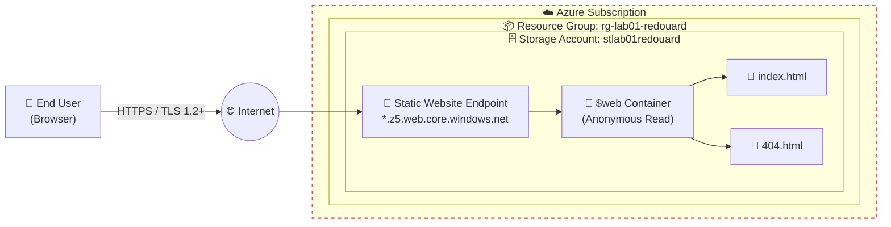
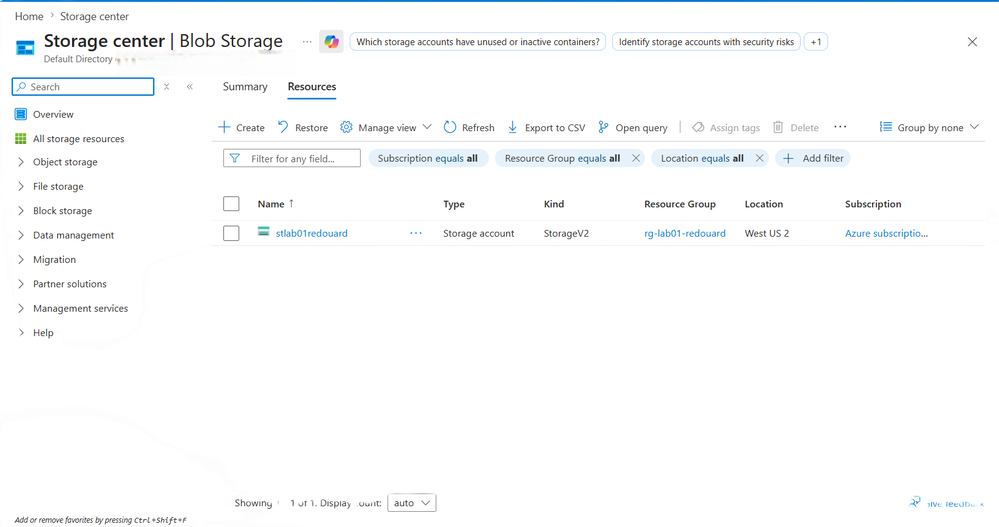
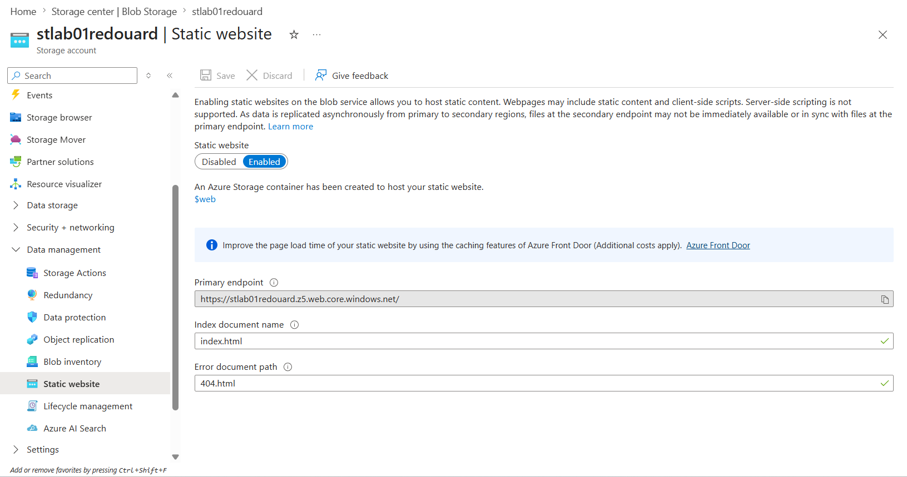
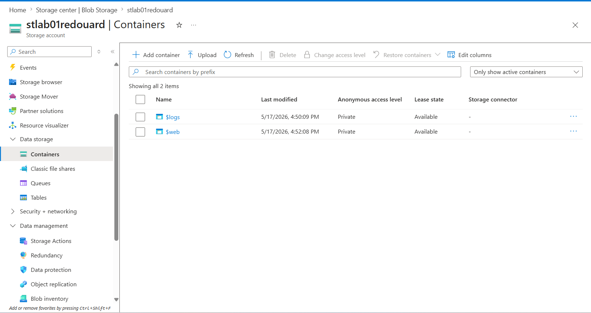
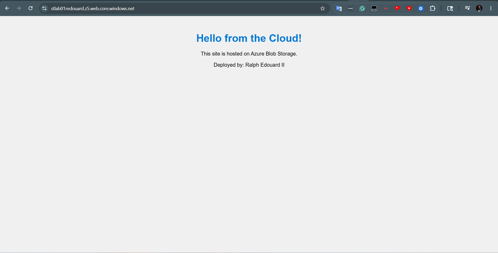

# Azure Static Website Lab

> **The Build Log — Lab 001 of 12**
> *Hosting a static website on Azure Blob Storage. No VM. No server to patch. Just files in a container and a public URL.*

[](#)
[](#)
[](#)
[](#)
[](LICENSE)

> **Author:** Ralph Edouard II
> **Series:** The Build Log — Azure Fundamentals
> **Status:** ✅ Completed

---

## 🎬 Watch Me Build This Lab

[**▶ Loom walkthrough**](https://www.loom.com/share/81d2fb1b470245889aeacc0a9ee984e0)

---

## 👋 About This Lab (and Me)

I'm a mid-career IT SysAdmin working my way toward a Cloud Security Engineer role, and this repo is where I'm documenting the labs I do along the way. The goal isn't just to *finish* the labs — it's to write them up the way I'd want to read them if I were the next person trying to learn this stuff.

This first one is a gentle intro: get a static website running on Azure without spinning up a single VM. No servers to patch, no OS to harden — just upload an HTML file and point the world at it. Good way to get comfortable clicking around the Azure Portal before things get more complicated.

---

## 📌 What I Built

A public static website hosted directly out of an **Azure Storage Account**, using the built-in **Static website** feature. Azure auto-creates a special container called `$web`, you drop your HTML in there, and Azure gives you a public URL. That's the whole lab.

The two concepts this introduced me to:

- **PaaS (Platform-as-a-Service)** — I'm not managing a server, Azure is. I just bring the content.
- **Serverless hosting** — same idea, different angle. No VM, no runtime to maintain.

Coming from a SysAdmin background, this felt weird at first. I'm used to *something* being a server. Here, there isn't one — and that's the point.

---

## 🏗️ Architecture



The dashed box around Azure is the trust boundary — once a request crosses into Azure, it's playing by Azure's rules (RBAC, storage account configs, the platform's identity and network layer). Everything outside is the open internet.

Walking through the flow:

1. A user types the endpoint URL into their browser.
2. DNS resolves to Azure's front door and the connection upgrades to HTTPS.
3. Azure's Static Website feature routes the request to the `$web` container.
4. They get back `index.html` (or `404.html` if they ask for something that doesn't exist).

---

## 🎯 What I Practiced

- Provisioning Azure resources through the Portal
- Sticking to a naming convention (cannot stress enough how much my future self will thank me for this)
- Configuring Static website hosting on a Storage Account
- Uploading blobs to a container
- Reading what an Azure endpoint URL is actually telling me
- **Cleaning up after myself** (more on this below — I learned this one the hard way)

---

## ✅ What You'll Need

| Requirement | Notes |
| --- | --- |
| Active Azure subscription | Free Tier is fine |
| Access to the [Azure Portal](https://portal.azure.com) | — |
| Text editor | VS Code, Notepad, TextEdit — whatever you've got |
| A little HTML comfort | Sample below, you don't need much |

---

## 🧾 Naming Convention I Used

| Resource | Pattern | What I Actually Used |
| --- | --- | --- |
| Resource Group | `rg-lab01-<yourname>` | `rg-lab01-redouard` |
| Region | Pick what's closest to you | `West US 2` |
| Storage Account | `stlab01<yourname>` | `stlab01redouard` |
| Redundancy | `LRS` (Locally-Redundant Storage) | `LRS` |
| Performance Tier | `Standard` | `Standard` |

> ⚠️ **Heads up on storage account names:** they have to be globally unique across *all* of Azure, lowercase letters and numbers only, 3–24 characters, no hyphens. Mine worked on the first try with just `stlab01redouard`, but if your name is common, plan on tacking on a few random digits as a fallback.
>
> 📍 **On region:** I used West US 2 because it's closest to me. Pick whichever region is closest to *you* — for a lab this small, it doesn't matter. For real production, region choice starts to matter for latency, data residency, and pricing.

---

## 🛠️ How I Built It

### Phase 1 — Create the Resource Group

1. Sign in to the [Azure Portal](https://portal.azure.com).
2. Search **Resource groups** → **+ Create**.
3. Fill in:
   - **Subscription:** yours
   - **Resource group:** `rg-lab01-<yourname>`
   - **Region:** whichever is closest to you
4. **Review + create** → **Create**.

### Phase 2 — Create the Storage Account

1. Search **Storage accounts** → **+ Create**.
2. On the **Basics** tab:
   - **Resource group:** `rg-lab01-<yourname>`
   - **Storage account name:** `stlab01<yourname>` (add digits if rejected)
   - **Region:** same as your resource group
   - **Performance:** `Standard`
   - **Redundancy:** `LRS`
3. **Review + create** → **Create**.
4. Once it's deployed, click **Go to resource**.



### Phase 3 — Enable Static Website Hosting

1. In the storage account's left-hand menu, under **Data management**, click **Static website**.
2. Flip the toggle to **Enabled**.
3. Set:
   - **Index document name:** `index.html`
   - **Error document path:** `404.html`
4. Click **Save**.
5. **Copy the Primary endpoint URL** that appears (mine was `https://stlab01redouard.z5.web.core.windows.net/`). That's your site's public address.



> 💡 I almost missed copying the URL the first time. Save it somewhere — you'll need it for the validation step.

### Phase 4 — Write the HTML File

I saved this as `index.html` on my desktop:

```html
<!DOCTYPE html>
<html>
<head>
    <title>My First Cloud Site</title>
    <style>
        body { font-family: sans-serif; text-align: center; margin-top: 50px; background-color: #f0f0f0; }
        h1 { color: #0078d4; }
    </style>
</head>
<body>
    <h1>Hello from the Cloud!</h1>
    <p>This site is hosted on Azure Blob Storage.</p>
    <p>Deployed by: Ralph Edouard II</p>
</body>
</html>
```

### Phase 5 — Upload the File

1. In the storage account, go to **Containers** (under **Data storage**).
2. There's already a container called `$web` sitting there — Azure made it for me when I enabled Static website. Open it.
3. Click **Upload**, pick your `index.html`, **Upload**.



> 💡 You'll also see a `$logs` container. Azure creates that one automatically for service-level logging. We're not using it for this lab, but good to know it exists.

### Phase 6 — Test It

1. New browser tab.
2. Paste the Primary endpoint URL from Phase 3.
3. "Hello from the Cloud!" 🎉



That's the whole site, live on the internet.

---

## 🔐 A Few Security Things I Noticed

I'm still early on the cloud security side, so take these as observations rather than expert guidance. Stuff that stood out to me as I went:

- **The `$web` container is anonymous-read on purpose.** That's how the whole "public website" thing works, but it did make me pause — anyone on the internet can fetch what's in there. Fine for this lab, would not be fine for anything sensitive.
- **Secure transfer required is enabled by default on new storage accounts** — worth confirming in the **Configuration** blade. That's also where you can enforce a minimum TLS version (1.2 is the modern baseline). Something I want to verify hands-on in a future lab.
- **Storage account keys are powerful.** They're full account-wide credentials. I didn't need to use them for this lab, but it clicked for me why production environments push you toward Entra ID identities and SAS tokens instead.
- **No logging by default on the data plane.** Azure created the `$logs` container, but actual diagnostic logging for blob requests needs to be turned on separately under Diagnostic settings. Something I want to dig into in a future lab.
- **The default endpoint has no WAF, no rate limiting, and no custom domain.** For a real site, you'd want Azure Front Door or a CDN in front of it.

Things I want to come back to once I've got more reps in.

---

## 💰 What This Cost

I didn't track cost formally for this one, but for the time the lab was live it was effectively pennies — Azure Blob Storage at LRS pricing is fractions of a cent per GB-month, and a couple HTML files barely register. The dangerous cost on a lab like this isn't the storage; it's **leaving it running**. See the cleanup section below.

Starting **Lab 002**, I'm tracking the actual cost of every lab via the **Cost Management + Billing** blade and recording it in the README. Building the habit now so it's automatic by the time the labs get more expensive.

---

## 🧰 Stuff That Tripped Me Up

**"404 — The requested content does not exist"**

The file has to be named **exactly** `index.html`. Case-sensitive. `Index.html` won't load. And it has to be in the `$web` container, not a different one you made by accident.

**The `$web` container is hidden by default**

Until you flip the **Static website** toggle to Enabled, the `$web` container doesn't exist. I spent a minute looking for it before I realized that's the order of operations: enable the feature first, *then* the container shows up.

**Changes don't show up after re-uploading**

Hard-refresh the browser (`Ctrl+F5` / `Cmd+Shift+R`). Both Azure and the browser cache, and I spent way too long thinking something was broken when I just needed to force a refresh.

---

## 🧹 Cleanup — The $1000 Lesson

This is honestly the most important section of this README.

In an earlier lab, I forgot to delete my resource group. Just walked away from it. Came back about a week later and had a bill close to **$1,000** waiting for me. That was a brutal way to learn that "I'll clean it up later" is not a real plan.

So now this is the rule, every single time:

1. Go to **Resource groups**.
2. Open `rg-lab01-<yourname>`.
3. Click **Delete resource group**.
4. Type the name to confirm → **Delete**.

> ⚠️ Deletion is permanent and wipes everything inside the group. That's exactly what I want it to do.

If you take *one* thing from this lab, let it be this: **delete your resource group when you're done.** Set a calendar reminder. Set a budget alert. Whatever it takes. The cloud doesn't care if you're "just learning" — the meter is running either way.

---

## 🧠 What I Took Away

- Static websites on Blob Storage are way simpler than I expected. No server, no patching, no runtime — just files in a container.
- **Naming conventions are not optional.** Even on Lab 01, consistent names made navigating the Portal much easier. I can already picture the chaos of mixed-up resources in a real environment.
- "Serverless" doesn't mean "no responsibility." Azure handles the infrastructure, but the configuration, the content, and the access controls are still on me.
- Coming from SysAdmin work, the biggest mental shift is letting go of the urge to manage *something*. Sometimes the right answer is to let the platform handle it.

---

## 📚 References

- [Static website hosting in Azure Storage — Microsoft Learn](https://learn.microsoft.com/azure/storage/blobs/storage-blob-static-website)
- [Azure Storage security baseline](https://learn.microsoft.com/security/benchmark/azure/baselines/storage-security-baseline)
- [Require secure transfer to ensure secure connections](https://learn.microsoft.com/azure/storage/common/storage-require-secure-transfer)

---

## 🗺️ The Build Log Series

- **Lab 001 — Azure Static Website Hosting** ← *you are here*
- Lab 002 — *coming soon*

---

*Part of my Cloud Security Engineer transition. Writing these up the way I'd want them written for me.*
